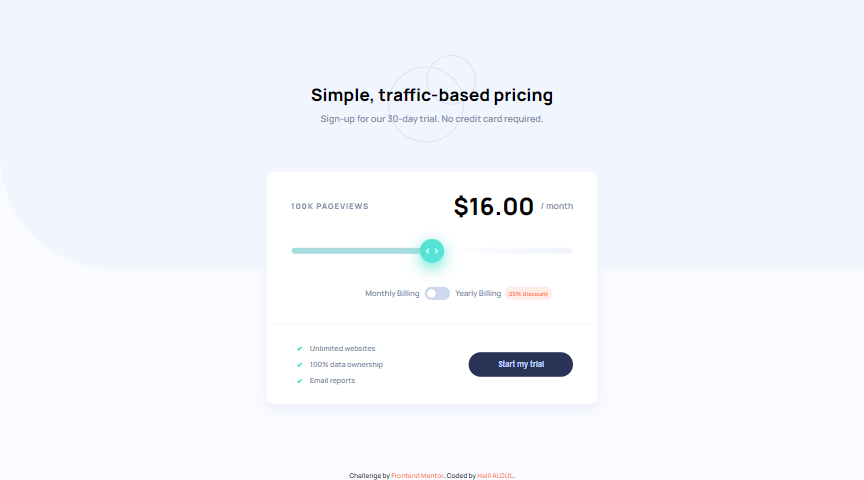
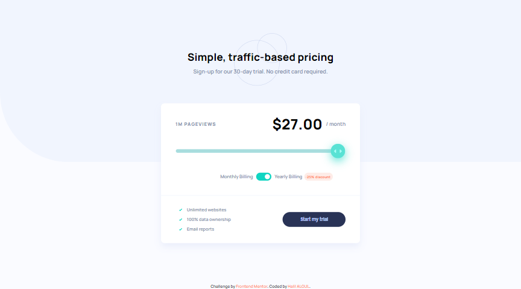
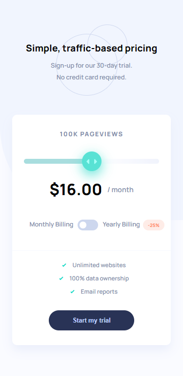

# Frontend Mentor - Interactive Pricing Component Solution

This is a solution to the [Interactive Pricing Component Challenge on Frontend Mentor](https://www.frontendmentor.io/challenges/interactive-pricing-component-t0m8PIyY8/hub/interactive-pricing-component-TeV-1lMeyD).

## Table of contents

- [Frontend Mentor - Interactive Pricing Component Solution](#frontend-mentor---interactive-pricing-component-solution)
  - [Table of contents](#table-of-contents)
  - [Overview](#overview)
    - [The challenge](#the-challenge)
    - [Page view and pricing totals](#page-view-and-pricing-totals)
    - [Screenshot](#screenshot)
    - [Links](#links)
    - [Built with](#built-with)
    - [Useful Codes](#useful-codes)
    - [Useful Resources](#useful-resources)
  - [Author](#author)

## Overview

### The challenge

Your users should be able to:

- View the optimal layout for the app depending on their device's screen size
- See hover states for all interactive elements on the page
- Use the slider and toggle to see prices for different page view numbers (details provided below)

### Page view and pricing totals

Here are the different page view ranges and the corresponding monthly price totals:

- 10K pageviews / $8 per month
- 50K pageviews / $12 per month
- 100K pageviews / $16 per month
- 500k pageviews / $24 per month
- 1M pageviews / $36 per month

If the visitor switches the toggle to yearly billing, a 25% discount should be applied to all prices.

### Screenshot

 
 
 
 
 

### Links

- Solution URL: [Frontend Mentor | My Solution](https://www.frontendmentor.io/solutions/intro-section-with-dropdown-navigation-html-css-js-BJE47Xewq)
  
- Live Site URL: [Halibal | Interactive Pricing Component](https://halibal.github.io/frontendmentor-projects/Intro_Section_With_Dropdown_Navigation/index.html)

### Built with

- Semantic HTML5 markup
- CSS custom properties
- [JavaScript](https://www.javascript.com)

### Useful Codes

### Useful Resources

- 
- 

## Author

- LinkedIn - [Halil ALGUL](https://www.linkedin.com/in/halilagul/)
- Frontend Mentor - [@halibal](https://www.frontendmentor.io/profile/halibal)
- github - [halibal](https://github.com/halibal)
