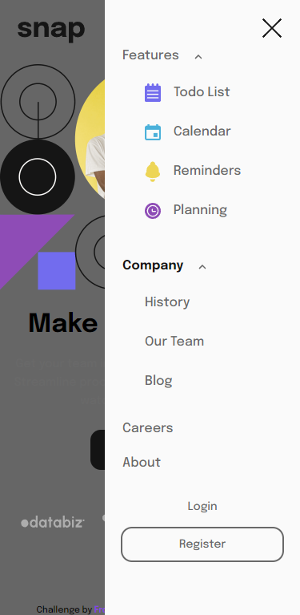

# Frontend Mentor - Intro Section With Dropdown Navigation Solution

This is a solution to the [Intro Section With Dropdown Navigation Challenge on Frontend Mentor](https://www.frontendmentor.io/challenges/ping-single-column-coming-soon-page-5cadd051fec04111f7b848da/hub/ping-single-column-coming-soon-page-rJk2e6BIc). Frontend Mentor challenges help you improve your coding skills by building realistic projects.

## Table of contents

- [Frontend Mentor - Intro Section With Dropdown Navigation Solution](#frontend-mentor---intro-section-with-dropdown-navigation-solution)
  - [Table of contents](#table-of-contents)
  - [Overview](#overview)
    - [The challenge](#the-challenge)
    - [Screenshot](#screenshot)
    - [Links](#links)
    - [Built with](#built-with)
    - [Useful Codes](#useful-codes)
    - [Useful Resources](#useful-resources)
  - [Author](#author)

## Overview

### The challenge

Users should be able to:

- View the relevant dropdown menus on desktop and mobile when interacting with the navigation links
- View the optimal layout for the content depending on their device's screen size
- See hover states for all interactive elements on the page

### Screenshot

 
 
 
 
 

### Links

- Solution URL: [Frontend Mentor | My Solution](https://www.frontendmentor.io/solutions/intro-section-with-dropdown-navigation-html-css-js-BJE47Xewq)
  
- Live Site URL: [Halibal | Intro Section With Dropdown Navigation](https://halibal.github.io/frontendmentor-projects/Intro_Section_With_Dropdown_Navigation/index.html)

### Built with

- Semantic HTML5 markup
- CSS custom properties
- [JS](https://www.javascript.com)

### Useful Codes

### Useful Resources

- [GeeksforGeeks | HTML  align Attribute](https://www.geeksforgeeks.org/html-img-align-attribute/)
- [Developer Mozilla | Shorthand Properties](https://developer.mozilla.org/en-US/docs/Web/CSS/Shorthand_properties)

## Author

- LinkedIn - [Halil ALGUL](https://www.linkedin.com/in/halilagul/)
- Frontend Mentor - [@halibal](https://www.frontendmentor.io/profile/halibal)
- github - [halibal](https://github.com/halibal)
